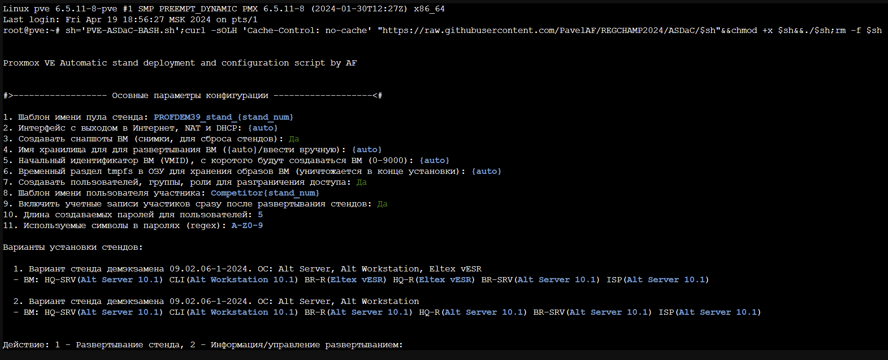

# #PROF39

Скрипт простого авторазвертывания стендов с виртуальной ИТ-инфраструктурой на базе гипервизора Proxmox VE и Альт Сервер Виртуализация (PVE)

Поддерживаемые версии: Proxmox VE от 7 до 8.2 (latest), Альт Сервер Виртуализация 10.0 и выше (PVE 7.0+)

Для Альт Сервер Виртуализации рекомендуется запускать скрипт из-под SSH (проблемы с in-out кодировкой xterm.js консоли. Кириллические символы в созданных объектах будут заменены на '�')

Скрипт позволяет просто и быстро автоматизировать развертывание стедов для различных мероприятий (Чемпионаты "Профессионалы", демонстрационый экзамен, учебные стенды и пр.), управлять конфигурацией, создавать свои конфигурации авторазвертывания

#### Быстрый старт:

1.  Открываем Proxmox, выбираем нужную Node и переходим в раздел
    “Shell”.

2. Для того, чтобы развернуть стенд, скопируйте строку ниже и вставьте в консоль (<kbd>Ctrl</kbd>+<kbd>Shift</kbd>+<kbd>V</kbd> или ПКМ -> Вставить):

```
sh='PVE-ASDaC-BASH.sh';curl -sOL "https://raw.githubusercontent.com/PavelAF/PVE-ASDaC-BASH/main/$sh"&&chmod +x $sh&&./$sh;rm -f $sh
```

После нажатия <kbd>Enter</kbd> скрипт запустится



При запуске скрипта в терминале выведется конфигурация развертывания и выбор опций развертывания

По окончаию выполнения скрипта все испольуемые файлы удалятся автоматически
