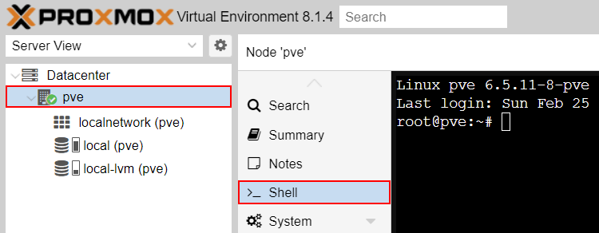
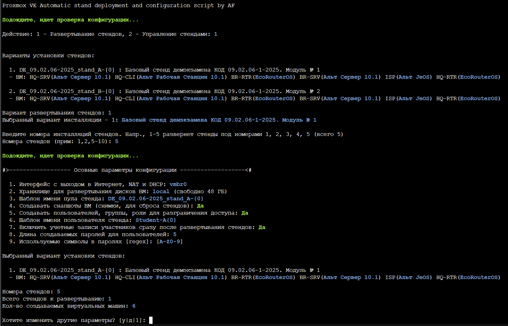

# #PROF39
<details>
  <summary><b>👉 Предупреждение для пользователей Альт Виртуализация PVE!</b></summary>
  <br>
  
  + **Потеря сетевой связности на запущенных ВМ после перезагрузки сети хоста PVE.** В конце установки или удаления стендов скрипт перезагружает сеть хоста для сохранения внесенных изменений (для создания/удаления виртуальных коммутаторов). Из-за бага, на Альт Виртуализация PVE все запущенные ранее машины потеряют коннект к своим бриджам! Это означает, что на всех ранее запущенных машинах сломается сеть и они не будут иметь сетевую связность!<br>
  **Как исправить**: выключить и включить эти машины (не перезагрузка!), либо к каждой ВМ вручную переприменить сетевые настройки, дергая каждый интерфейс!
  <br>
  
  + **Пропадание описаний к сетевым интерфейсам (description).** На самом деле, в самом конфиг файле интерфейсов описания не пропадают, просто PVE их не может корректно считать из-за того, что модуль-прокладка для etcnet добавляет свои доп. параметры в конфиг (а еще и по несколько раз) и родной модуль их не понимает.<br>
  **"Костыльное" исправление**: 1. применить сетевые настройки, если не применены. 2. зайти в файл /etc/network/interfaces, убрать дублирующиеся строки и настройку "HOST="
  
  ___
</details>
<details>
  <summary><b>👉 Конфигурации авторазвертывания для СПО (ДЭ и РЧ)</b></summary>
  <br>
  
  &nbsp;&nbsp;&nbsp;&nbsp;&nbsp;&nbsp;**Стенды для регионального чемпионата СиСА 2025 (модуль Б)**
  ```bash
  (b=testing_api opts=( PVE-ASDaC-BASH.sh -c 'https://disk.yandex.ru/d/1-vlJJU_0mzefA' -z ) ;curl -sfOL "https://raw.githubusercontent.com/PavelAF/PVE-ASDaC-BASH/$b/${opts[0]}"&&{ chmod +x ${opts[0]}&&./"${opts[@]}";rm -f ${opts[0]};:;}||echo -e "\e[1;33m\nОшибка скачивания: проверьте подключение к Интернету, настройки DNS, прокси и URL адрес\ncurl exit code: $?\n\e[m">&2)
  ```
  <details>
    <summary>👉 Стенд РЧ: системные требования и <b>особенности установки</b></summary>
    <br>
    В предложенной конфигурации представлены две версии развертки: одна предполагает доступность к настройке виртуального коммутатора SW-DT участнику, как того требует задание. Во втором варианте участник не будет иметь доступ к SW-DT, но коммутатор уже будет преднастроен. Это противоречит заданию, однако это единственный безопасный вариант для тех, у кого версия PVE младше 8.x (Альт Виртуализация и Proxmox VE <= 7.4). Т.к. в более ранних версиях PVE нет возможности тонко разграничить права для сетевых интерфейсов, в первом варианте участники будут иметь доступ к прикриплению всех хостовых bridge интерфейсов к ВМ, что может привести к неспортивному поведению.<br>
    <b>UPD</b>: На виртуальные машины SW{X}-HQ был предустановлен пакет <b>Open vSwitch</b>
    <br>
    <br>
    
  
  ___
  </details>
  <br>
  
  &nbsp;&nbsp;&nbsp;&nbsp;&nbsp;&nbsp;**Стенды демекзамена 09.02.06-2025, классический**
  ```bash
  (b=testing_api opts=( PVE-ASDaC-BASH.sh -c 'https://disk.yandex.ru/d/_20fjve5ERh5Sg' -z ) ;curl -sfOL "https://raw.githubusercontent.com/PavelAF/PVE-ASDaC-BASH/$b/${opts[0]}"&&{ chmod +x ${opts[0]}&&./"${opts[@]}";rm -f ${opts[0]};:;}||echo -e "\e[1;33m\nОшибка скачивания: проверьте подключение к Интернету, настройки DNS, прокси и URL адрес\ncurl exit code: $?\n\e[m">&2)
  ```
  &nbsp;&nbsp;&nbsp;&nbsp;&nbsp;&nbsp;**Стенды демекзамена 09.02.06-2025, все ВМ - ОС Альт**
  ```bash
  (b=testing_api opts=( PVE-ASDaC-BASH.sh -c 'https://disk.yandex.ru/d/9b8nYPkE7UDHHA' -z ) ;curl -sfOL "https://raw.githubusercontent.com/PavelAF/PVE-ASDaC-BASH/$b/${opts[0]}"&&{ chmod +x ${opts[0]}&&./"${opts[@]}";rm -f ${opts[0]};:;}||echo -e "\e[1;33m\nОшибка скачивания: проверьте подключение к Интернету, настройки DNS, прокси и URL адрес\ncurl exit code: $?\n\e[m">&2)
  ```
  ___
</details>
<details>
  <summary><b>👉 Конфигурации авторазвертывания для юниоров </b></summary>
  <br>
  
  &nbsp;&nbsp;&nbsp;&nbsp;&nbsp;&nbsp;**[Ред., Бета-версия] Стенды для регионального чемпионата ССА Юниоры 2025 (модуль Б и Г)**
  ```bash
  (b=testing_api opts=( PVE-ASDaC-BASH.sh -c 'https://disk.yandex.ru/d/YR3eelCZR_JVXQ/Script-Images/ASDaC_RCJ-2025_multi.conf_v2.txt' -z ) ;curl -sfOL "https://raw.githubusercontent.com/PavelAF/PVE-ASDaC-BASH/$b/${opts[0]}"&&{ chmod +x ${opts[0]}&&./"${opts[@]}";rm -f ${opts[0]};:;}||echo -e "\e[1;33m\nОшибка скачивания: проверьте подключение к Интернету, настройки DNS, прокси и URL адрес\ncurl exit code: $?\n\e[m">&2)
  ```
  <details>
    <summary>👉 <b>Информация</b>: автор конфигурации, инструкция по развертыванию</summary>
    <br>
    Разработчик: Рачеев А.В.<br>
    Под редакцией <a href="https://github.com/PavelAF">@PavelAF</a>
    <br><br>
    
Ссылка на инструкцию [README](https://disk.yandex.ru/d/YR3eelCZR_JVXQ/Script-Images/README.txt)<br>
Ссылка общую папку с файлами по заданию: [https://disk.yandex.ru/d/YR3eelCZR_JVXQ](https://disk.yandex.ru/d/YR3eelCZR_JVXQ)
    
  </details>
  
  ___
</details>
<br>

**PVE-ASDaC-BASH** - скрипт простого авторазвертывания конфигураций ИТ-инфраструктуры на базе платформ виртуализаций Proxmox VE и Альт Виртуализация (PVE)
<br><br>
Скрипт позволяет просто и быстро автоматизировать развертывание стендов для различных мероприятий (Чемпионаты "Профессионалы", демонстрационый экзамен, учебные стенды и пр.), управлять конфигурацией, создавать свои конфигурации авторазвертывания
<br><br>
Поддерживаемые версии: Proxmox VE 7.0 - 8.2 (8.3 - в ветке testing_api), Альт Виртуализация 10.0 - 10.2
<br>

**Более подробная информация о скрипте на страницах [вики](../../wiki)**
<br>

**В случае возникновения проблем следует ознакомиться с этой [страницей](../../wiki/Правила-подачи-репорта)**

## Быстрый старт

1.  Открываем Proxmox, выбираем нужную Node и переходим в “Shell”.

2. Для того, чтобы развернуть готовую конфигурацию, скопируйте строку для скачивания и вставьте в консоль (<kbd>Ctrl</kbd>+<kbd>Shift</kbd>+<kbd>V</kbd> или ПКМ -> Вставить). Пример:

```
sh='PVE-ASDaC-BASH.sh';curl -sOL "https://raw.githubusercontent.com/PavelAF/PVE-ASDaC-BASH/main/$sh"&&chmod +x $sh&&./$sh -c https://disk.yandex.ru/d/HDgvq-iMbduqag -z;rm -f $sh
```

После нажатия <kbd>Enter</kbd> скрипт скачается и запустится



При запуске скрипта в терминале выведется конфигурация развертывания и выбор опций развертывания

По окончанию выполнения скрипта все испольуемые файлы удаляются автоматически
