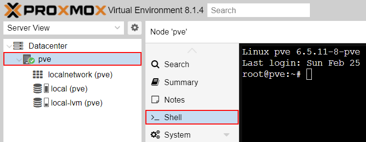
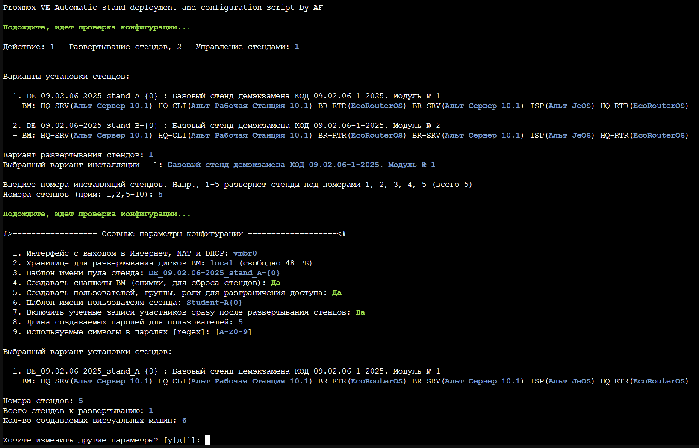

# #PROF39
<details>
  <summary><b>👉 🆕 Распространенные баги и проблемы при запуске !</b></summary>
<br>

**Баг аддона ovs в ifupdown2:** На Proxmox VE и Альт Виртуализации **p11** PVE, в качестве менеджера сети используется ifupdown2. При использовании OVSBridge с настроенными ovs_options, при релоаде сети хоста (командой или через применение сетевых настроек в PVE GUI или API) настроенные ovs_options для бриджа сбрасываются. Это связано с неправильным применением и непоследовательной логикой очистки от нежелательных настроек для OVSBridge, реализованной в [аддоне](https://github.com/CumulusNetworks/ifupdown2/blob/master/ifupdown2/addons/openvswitch.py) ifupdown2/addons/openvswitch.py ([bugzilla](https://bugzilla.proxmox.com/show_bug.cgi?id=7030))
<br>
**Решение:** вместе с добавлением функциональности создания OVSBridge интерфейсов в PVE-ASDaC-BASH, был добавлен твик, который исправляет эту проблему. Он запускается автоматически при развертывании конфигурации с назначенными OVSBridge интерфейсами. Твик представляет из себя if-pre-up скрипт, который доприменяет недостающие настройки ovs_options для OVSBridge

**[Не подтверждено] Новый баг Альт Виртуализации :** созданные/измененные ресурсы сохраняются в PVE с опозданием, из-за чего несколько подряд изменений конфигурации через PVE API не успевают примениться и возникает ошибка, скрипт завершает свою работу. Такое поведение наблюдается как на 10, так и на 11 Альт Виртуализации. Репортите в Issue, если столкнулись с тем же. Предварительно, виновники: недавнее обновление пакетов systemd, glibc, fuse привнесло сбой в работу pxmxcfgs, что привело к ошикам кеширования/синхронизации конфигурации
  
  **В новой версии ОС "Альт Виртуализация PVE (p11)"**, из-за отказа от менеджера сети etcnet, **нижеописанные проблемы больше не являются актуальными!**
  
  + **Потеря сетевой связности на запущенных ВМ после перезагрузки сети хоста PVE.** В конце установки или удаления стендов скрипт перезагружает сеть хоста для сохранения внесенных изменений (для создания/удаления виртуальных коммутаторов). Из-за бага, на Альт Виртуализация все запущенные ранее машины потеряют коннект к своим бриджам! Это означает, что на всех ранее запущенных машинах сломается сеть и они не будут иметь сетевую связность!<br>
  **Как исправить**: **[testing_api branch]** Добавлен твик-фикс. Активируется (по желанию, только для Альт ОС) при установке/удалении стендов или запускается отдельно в разделе меню "**Утилиты**"
  
  + **Не отображаются описания к сетевым интерфейсам (description).** Это происходит, когда бекенд PVE не может корректно считать настройки сети из файла /etc/network/interfaces из-за того, что модуль-прокладка для etcnet при конфигурации сети вносит неверные/дублирующиеся опции в конфиг, тем самым ломая его<br>
  **"Костыльное" исправление**: 1. Применить настройки  сети узла PVE, если не применены. 2. Зайти в файл /etc/network/interfaces, убрать дублирующиеся строки, настройку "HOST="
  
  ___
</details>

<details open>
  <summary><b>👉 Конфигурации авторазвертывания для СПО (ДЭ и РЧ)</b></summary>
  <br>
  
  - **[v6] Стенды демекзамена 09.02.06-2026, все ВМ - ОС Альт**
  ```bash
  (b=testing_api cmd=( PVE-ASDaC-BASH.sh -c 'https://disk.yandex.ru/d/zJPHFPCgv2Cdfw' -z ) ;curl -sfOL "https://raw.githubusercontent.com/PavelAF/PVE-ASDaC-BASH/$b/${cmd[0]}"&&{ chmod +x ${cmd[0]}&&./"${cmd[@]}";rm -f ${cmd[0]};:;}||echo -e "\e[1;33m\nОшибка скачивания: проверьте подключение к Интернету, настройки DNS, прокси и URL адрес\ncurl exit code: $?\n\e[m">&2)
  ```
  </details>
</details>
<details>
  <summary><b>👉 Конфигурации авторазвертывания для юниоров </b></summary>
  <br>
  
  - **[Ред.] Стенды для регионального чемпионата ССА Юниоры 2026 (модуль Б и Г)**
  ```bash
  (b=testing_api opts=( PVE-ASDaC-BASH.sh -c 'https://disk.yandex.ru/d/YR3eelCZR_JVXQ/Script-Images/ASDaC_RCJ-2025_multi.conf_v2.txt' -z ) ;curl -sfOL "https://raw.githubusercontent.com/PavelAF/PVE-ASDaC-BASH/$b/${opts[0]}"&&{ chmod +x ${opts[0]}&&./"${opts[@]}";rm -f ${opts[0]};:;}||echo -e "\e[1;33m\nОшибка скачивания: проверьте подключение к Интернету, настройки DNS, прокси и URL адрес\ncurl exit code: $?\n\e[m">&2)
  ```
  <details>
    <summary>👉 <b>Информация</b>: автор конфигурации, инструкция по развертыванию</summary>
    <br>
    Разработчик: Рачеев А.В.<br>
    Под редакцией <a href="https://github.com/PavelAF">@PavelAF</a>
    <br><br>
    
Ссылка на инструкцию [README](https://disk.yandex.ru/d/YR3eelCZR_JVXQ/Script-Images/README.txt)<br>
Ссылка общую папку с файлами по заданию: [https://disk.yandex.ru/d/YR3eelCZR_JVXQ](https://disk.yandex.ru/d/YR3eelCZR_JVXQ)
    
  </details>
  
  ___
</details>

> [!NOTE]
> **👉 [Архивные конфигурации](./deployment_configs.md)**
<br>

**PVE-ASDaC-BASH** - скрипт простого авторазвертывания конфигураций ИТ-инфраструктуры на базе платформ виртуализаций Proxmox VE и Альт Виртуализация (PVE)
<br><br>
Скрипт позволяет просто и быстро автоматизировать развертывание стендов для различных мероприятий (Чемпионаты "Профессионалы", демонстрационый экзамен, учебные стенды и пр.), управлять конфигурацией, создавать свои конфигурации авторазвертывания
<br><br>
**Поддерживаемые версии платформ:** Proxmox&nbsp;VE&nbsp;7.2&nbsp;-&nbsp;9.x, Альт&nbsp;Виртуализация&nbsp;10.x&nbsp;-&nbsp;11.x
<br>

**Более подробная информация о скрипте на страницах [вики](../../wiki)**
<br>

**В случае возникновения проблем следует ознакомиться с этой [страницей](../../wiki/Обратная-связь)**

## Быстрый старт

1.  Открываем Proxmox, выбираем нужную Node и переходим в “Shell”.

2. Для того, чтобы развернуть готовую конфигурацию, скопируйте строку для скачивания и вставьте в консоль (<kbd>Ctrl</kbd>+<kbd>Shift</kbd>+<kbd>V</kbd> или ПКМ -> Вставить). Пример:

```
(b=testing_api cmd=( PVE-ASDaC-BASH.sh -c 'https://disk.yandex.ru/d/zJPHFPCgv2Cdfw' -z ) ;curl -sfOL "https://raw.githubusercontent.com/PavelAF/PVE-ASDaC-BASH/$b/${cmd[0]}"&&{ chmod +x ${cmd[0]}&&./"${cmd[@]}";rm -f ${cmd[0]};:;}||echo -e "\e[1;33m\nОшибка скачивания: проверьте подключение к Интернету, настройки DNS, прокси и URL адрес\ncurl exit code: $?\n\e[m">&2)
```

После нажатия <kbd>Enter</kbd> скрипт скачается и запустится



При запуске скрипта в терминале выведется конфигурация развертывания и выбор опций развертывания

По окончанию выполнения скрипта все испольуемые файлы удаляются автоматически
